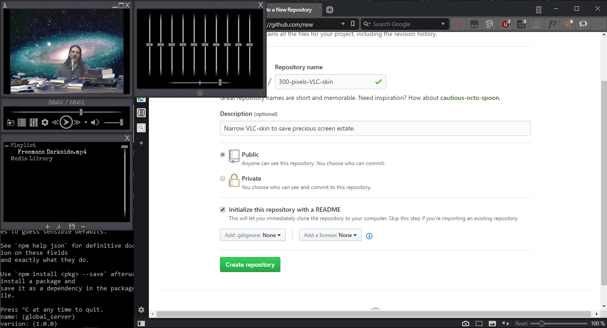

### Narrow VLC-skin to save precious screen estate.

VLC-skin I made years ago with that terribly outdated [skin-editor](http://get.videolan.org/skin-editor/0.8.5/) 'cos vlc seems to become wider by every release and I usually work on something while having a lecture or podcast running on the side there.

